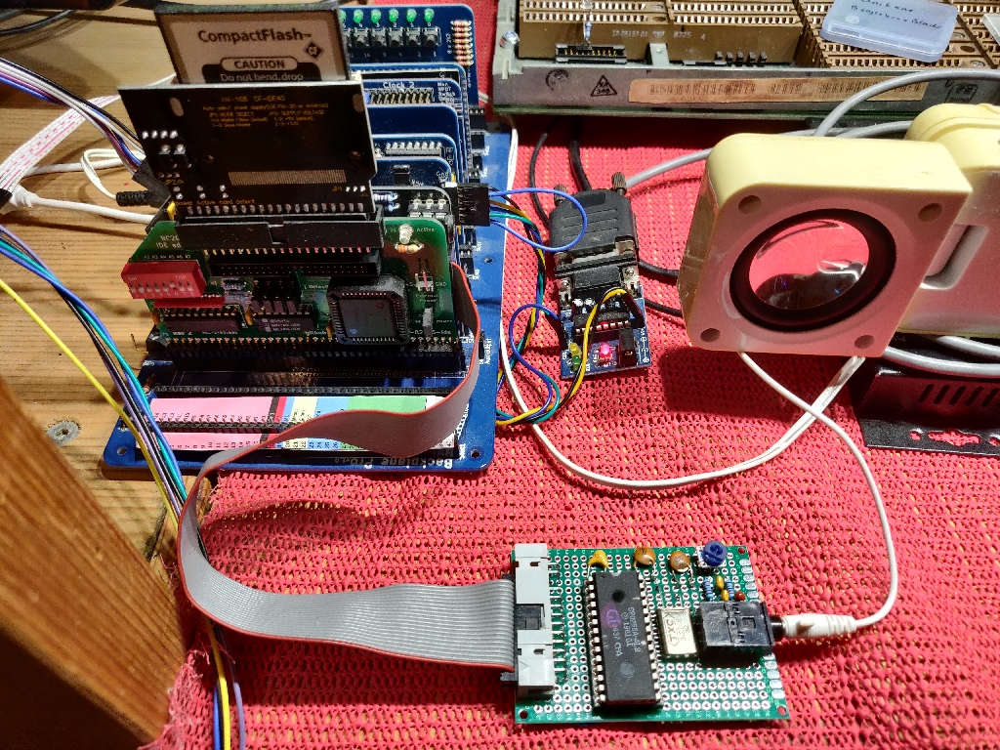

# RC2014-SP0256-Speech
Implementation of SP0256-AL2 speech synth on RC2014 sound card I/O expansion port



## Demo source code

```
/*
 * SP0256A-AL2 speach synthesizer driver
 * uses RC2014 sound card i/o ports
 
 * Compiled to .com (.bin) file with z88dk - sdcc
 * zcc +cpm -vn -SO3 -clib=sdcc_iy --max-allocs-per-node200000 saynum2.c -o saynum2 -create-app
 
 * D. Richards, September 2021
 */

#include <ctype.h>
#include <stdio.h>
#include <string.h>
#include <stdlib.h>
#include <z80.h>

// PSG sound card i/o registers
#define PSG_IO_BASE 0xD0
#define PSG_IO_ADDR (PSG_IO_BASE+8)
#define PSG_IO_DATA (PSG_IO_BASE+0)

// PSG internal register addresses
#define PSG_Reg_DDR     0x07
#define PSG_Reg_Port_A  0x0e
#define PSG_Reg_Port_B  0x0f

// PSG register bits
#define PSG_DDR_Port_A  0x40//(1<<6)
#define PSG_DDR_Port_B  0x80//(1<<7) 

// access to I/O ports
__sfr __at PSG_IO_ADDR PSG_Addr;
__sfr __at PSG_IO_DATA PSG_Data;

void say(int i); 		// send speach index, then strobe

// Outputs to SP0256A 
#define SP0256A_ALD		(1<<0)	// Strobe,      IO_B0 Pin 10
#define SP0256A_RST		(1<<1)	// Reset        IO_B1 Pin 9

// Inputs from SP0256A
#define SP0256A_LRQ		(1<<6)	// Buffer full, IO_B6 Pin 4
#define SP0256A_SBY		(1<<7)	// Busy,        IO_B7 Pin 3

#define SAY_NOTHING 0xff

int welcome[]= { 0x2E, 0x07, 0x2D, 0x02, 0x29, 0x0F, 0x10, 0x03,
                 0x02, 0x0D, 0x1F, 0x03, 0x02, 0x0D, 0x17, 0x02,
                 0x29, 0x0C, 0x2C, 0x03, 0x0C, 0x2D, 0x07, 0x02,
                 0x29, 0x02, 0x0D, 0x0E, 0x18, 0x0B, 0x0C, 0x02,
                 0x29, 0x37, 0x03, 0x04, 0x06, 0x03, 0x39, 0x35,
                 0x02, 0x09, 0x03, 0x19, 0x1F, 0x03, 0x39, 0x1A,
                 0x23, 0x03, 0x0F, 0x03, 0x01, 0x22, 0x0E, 0x14,
                 0x02, 0x0D, 0x03, 0x01, 0x21, 0x14, 0x03, 0x07,
                 0x02, 0x29, 0x37, 0x02, 0x29, 0x2D, 0x0F, 0x10,
                 0x14, 0x25, 0x0F, 0x0B, 0x02, 0x09, 0x05, 0x0B,
                 0x02, 0x0D, 0x03, 0xFF };

int num_bytes = sizeof(welcome) / sizeof(welcome[0]);

void init(void)
{
  PSG_Addr=PSG_Reg_DDR;		 	    // a & b outputs
  PSG_Data=PSG_DDR_Port_A | PSG_DDR_Port_B;
  PSG_Addr=PSG_Reg_Port_B;			// clear b
  PSG_Data=0x00;
  PSG_Addr=PSG_Reg_Port_A;      	// clear a
  PSG_Data=0x00;

  // toggle reset here

}

void wait(void) // wait for busy set after speech is finished
{
  long wd=0;

  PSG_Addr=PSG_Reg_DDR;			    // select ddr register
  PSG_Data=PSG_DDR_Port_A;

  for(wd=0; wd<50000; wd++)     // watchdog timout on int bit
  {
    PSG_Addr=PSG_Reg_Port_B;		// select b
    if((volatile unsigned int)PSG_Addr & SP0256A_SBY) // check for busy high
    {
      break;
    }     
  }  
  PSG_Addr=PSG_Reg_DDR;			    // restore a & b as outputs
  PSG_Data=PSG_DDR_Port_A | PSG_DDR_Port_B;
  return;
}

void say(int i) // send speach index value, then strobe and wait
{
  if(i<SAY_NOTHING)
  {
    PSG_Addr=PSG_Reg_Port_B;			// select b
    PSG_Data=0x00;			          	// set low (strobe)

    PSG_Addr=PSG_Reg_Port_A;			// select a
    PSG_Data=i;				            // set key (data)

    PSG_Addr=PSG_Reg_Port_B;			// select b
    PSG_Data=SP0256A_ALD;			    // set strobe

    wait(); // wait busy clear from SP0256A, timeout otherwise
  }
}

int main(int argc, char* argv[])
{
  int i;      
//  long value;

  init();  

#if 0
  if(argc>1)
  {
    for(i=1; i<argc; i++)
    {
      //printf("argc %d, argv=[%s]\n", i, argv[i]);
      value = strtol(argv[i], (char **)NULL, 10);      
      //convertToWords(value);
    }
  } 
#endif

  for(i=0; i<num_bytes; i++)
  {
//    printf("%d=%d\n", i,welcome[i]);
	say(welcome[i]);
  }

  return 0;
}
```
### Download source

[saynum2.c](./src/saynum2.c)

## Google Group Discussion

[RC2014-z80](https://groups.google.com/g/rc2014-z80/c/bjtIXDsHMyU/m/D0oMkvoeAQAJ)

## Demo video

[video](https://youtu.be/QZG8IEViWQY)

## Datasheet

[datasheet](./documents/Sp0256al2_datasheet.pdf)

## Useful websites

[Ready-Z80](https://github.com/bchiha/Ready-Z80)


[CPCWiki](https://www.cpcwiki.eu/index.php/SP0256)

